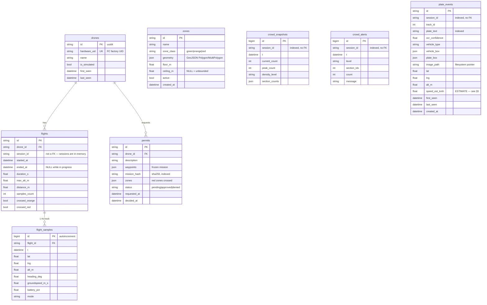

# Database — PostgreSQL

How HYRAK uses Postgres, what lives in it, and what deliberately does not.

Verified against the running instance on 2026-08-01: **PostgreSQL 16.14**,
database `hyrak`, role `hyrak`, schema `public`, alembic head `bd47308d11f5`.

---

## 1. The governing rule: the database is optional

This is the single most important thing to understand about the layer, and it
shapes every module that touches it.

`app/db/engine.py` connects at startup and records whether it succeeded:

```python
async def init_db() -> bool:
    try:
        _engine = create_async_engine(settings.database_url, pool_size=5, pool_pre_ping=True)
        async with _engine.connect():
            pass  # connectivity check only — schema is managed by alembic
        _session_factory = async_sessionmaker(_engine, expire_on_commit=False)
        _available = True
    except Exception as e:
        _available = False
        logger.warning(f"Database unavailable — persistent features disabled: {e}")
    return _available
```

Called from `app/server.py:88` with the comment *"non-fatal — flying never
depends on the DB"*.

Every consumer then guards on `db_available()` and degrades to `None` / `[]` /
no-op. The reason is safety, not convenience: **a drone must never become
unflyable because a database is unreachable.** Telemetry, arming, manual
control, mission upload and the video pipeline all work with Postgres stopped.
What you lose is history, the drone registry, zone enforcement and permits.

A corollary worth internalising: *absence of a row is never an error path in
this codebase.* Callers do not need their own fallback logic, so you will not
find try/except around registry or persistence calls at the call site.

---

## 2. Stack

| Piece | Choice | Note |
|---|---|---|
| Server | PostgreSQL 16.14 | local; DSN swap is the only change for Supabase/RDS |
| Driver | `asyncpg` ≥ 0.29 | async all the way down, no thread pool |
| ORM | SQLAlchemy ≥ 2.0 | `DeclarativeBase` + `Mapped[]` typed columns |
| Migrations | alembic ≥ 1.13 | 4 revisions, async `env.py` |
| Pool | `pool_size=5`, `pool_pre_ping=True` | pre-ping matters: laptop suspend kills idle conns |

Configured by `DATABASE_URL` in the root `.env`, defaulting in
`backend/app/config.py:58` to
`postgresql+asyncpg://hyrak:…@127.0.0.1:5432/hyrak`.

`alembic/env.py` deliberately overrides `alembic.ini`:

```python
# The URL always comes from app settings (.env / DATABASE_URL), never from
# alembic.ini — one source of truth for app and migrations.
config.set_main_option("sqlalchemy.url", get_settings().database_url)
```

So migrations can never run against a different database than the app.

---

## 3. What is *not* in Postgres

Equally structural. Three categories are intentionally excluded:

**Sessions.** `app/sessions/models.py` defines `DroneSession` as a plain
`@dataclass`, held in memory. One session = one browser tab connected to one
drone. It dies with the socket, so persisting it would only create rows nobody
can resume. Note the consequence: `Flight.session_id` and every
`crowd_*`/`plate_events.session_id` are **plain indexed strings, not foreign
keys** — there is no `sessions` table for them to reference.

**Live telemetry.** The 1 Hz sample written to `flight_samples` is a
deliberate downsample of a much faster stream. Nothing writes per-frame.

**Zone geometry at query time.** See §6 — zones are read from Postgres *once*
into an in-process spatial index.

---

## 4. Schema

Eight application tables, plus alembic's `alembic_version`.



`zones`, `crowd_*` and `plate_events` are islands — no foreign keys in or out.

### Live contents

| Table | Rows | Purpose |
|---|---|---|
| `flight_samples` | 2,677 | 1 Hz flight tracks |
| `crowd_snapshots` | 527 | across 12 distinct sessions |
| `plate_events` | 43 | one row per vehicle, not per frame |
| `flights` | 24 | 18 closed, **6 still open** (§8) |
| `zones` | 8 | 4 red, 4 orange — all Hyderabad, all `(approx)` |
| `drones` | 6 | 1 real, 5 SITL |
| `crowd_alerts` | 0 | no sustained-density alert has fired yet |
| `permits` | 0 | flow built, never exercised |

### Indexes

18 total. Beyond primary keys: one **unique** index on
`drones.hardware_uid`, and plain btrees on every foreign key
(`flights.drone_id`, `flight_samples.flight_id`, `permits.drone_id`) plus
`permits.mission_hash`, `plate_events.plate_text`, and `session_id` on all
three vision tables. Every hot lookup is covered.

---

## 5. Table-by-table intent

**`drones` — identity.** Keyed by the flight controller's factory-burned
hardware UID, read via MAVLink `AUTOPILOT_VERSION` through the MAVSDK Info
plugin. The design point, quoting the model: *"a drone's identity is never the
session's identity."* A browser refresh or radio reconnect maps back to the
same row. `upsert_seen()` in `app/registry/drones.py` runs on every telemetry
connect — unknown UID creates `Drone-{last 6 of UID}`, known UID just bumps
`last_seen`. `is_simulated` exists because SITL instances share a dummy UID and
real fleet views must filter them out.

**`zones` — airspace.** GeoJSON geometry, chosen because it converts cleanly
to and from ED-269 / Digital Sky. 3D-aware via `floor_m` / `ceiling_m`
(metres AGL at the zone), which is what lets the seeded "8–12 km above 60 m"
band exist as a real constraint rather than a flat circle. Seeded by
`backend/scripts/seed_hyderabad_zones.py`, which is idempotent (matches by
name) and labels everything `(approx)` — DGCA Digital Sky is the legal
authority and has no bulk-download API.

**`flights` + `flight_samples` — history.** A flight is armed → disarmed.
`app/flights/recorder.py` receives every telemetry snapshot, no-ops unless
armed, and writes one sample per second. Distance accumulates by haversine
between consecutive fixes; `crossed_orange` / `crossed_red` are latched by
asking the zone engine about each sample, and stop being checked once both are
true. `end_flight()` is idempotent and also fires on disconnect *"so a dropped
link never leaves a flight dangling open."*

**`permits` — the red-zone escape hatch.** A blocked mission can be submitted
with justification; the waypoint list is **frozen into the row**. After
approval, an upload passes validation only if it matches those waypoints within
`1.1e-5` degrees (≈1.1 m) and 0.5 m altitude — enough to absorb float noise,
tight enough to reject a real edit. `mission_hash` is a sha256 over waypoints
rounded to 6 dp for the fast path; `_matches()` is the tolerant fallback.

**`crowd_snapshots` / `crowd_alerts` / `plate_events` — vision output.**
Written through `app/vision/persistence.py`. Analyzers decide *when* to persist
inside their blocking `_analyze_frame_blocking` (that is where their per-session
state lives), queue it onto `meta["_pending_db"]`, and `stream_track.py`'s
`recv()` — already on the event loop — pops and dispatches it.

Two notes carried in the code that matter operationally:

- `plate_events.speed_est_kmh` is a ground-sample-distance estimate from drone
  altitude and FOV. The model comments: *"NOT a calibrated/certified reading …
  never present this as enforcement-grade evidence."* It always travels with
  `is_estimate=True`.
- `plate_events.image_path` points at the filesystem, not a bytea column. So
  `clear_plate_history()` collects paths, deletes rows, *then* unlinks files —
  a plain `DELETE` in psql would orphan the images.

---

## 6. Zones do not query Postgres

Worth its own section because it surprises people reading `zones/engine.py`.

Postgres is the *store*; it is not in the query path. `reload()` pulls every
`active` zone once, converts GeoJSON to shapely geometries, and builds an
`STRtree` spatial index behind a `threading.Lock`. Every subsequent
`check_point()` / `predict_red()` is pure in-process computation.

The rationale, from the module docstring:

> At the current scale an STRtree over every active zone answers point and path
> queries in microseconds — no PostGIS needed until zone counts reach the tens
> of thousands.

There is **no PostGIS extension installed**, and none is needed. Red zones also
get a `geom_eroded` copy (buffered by −5 m) so that skimming a boundary does
not trigger breach pushback — only a track genuinely inside does.

The trade-off: a zone edited directly in SQL is invisible until `reload()`
runs. The API routes call it after mutations; the seed script tells you to
restart the backend.

---

## 7. Retention

There is no auto-purge anywhere, and for the vision tables that is a
*deliberate reversal*. From `persistence.py`:

> Nothing is ever purged silently — that's a deliberate reversal of this
> feature's first version, which auto-purged on every stop; Japesh wanted a
> browsable history instead.

Data leaves only two ways: an operator downloads a report (read-only, deletes
nothing) or explicitly clears history via `DELETE /api/vision/crowd-history` /
`plate-history`, both behind an `X-Auth-Token` header.

---

## 8. Things I found that are worth knowing

Not blockers, but real, and better recorded than rediscovered.

**Six flights are permanently open.** `ended_at IS NULL`,
`samples_count = 0`, yet they hold 1,106 `flight_samples` rows between them
(213, 212, 211, 157, 157, 156). These are backends killed while armed —
`end_flight()` never ran, so the summary was never written. That is why the
`flights.samples_count` total (1,571) disagrees with the actual row count
(2,677). Any query that sums `samples_count` under-reports by ~41%. A startup
sweep closing stale open flights would fix it.

**JSON columns are `json`, not `jsonb`.** All six — `zones.geometry`,
`permits.waypoints`, `permits.zones`, `crowd_snapshots.section_counts`,
`plate_events.vehicle_box` / `plate_box`. SQLAlchemy's generic `JSON` type maps
to Postgres `json`, which stores raw text: no binary parse, no GIN indexing, no
containment operators. Nothing today queries *inside* these columns, so it
costs nothing right now. It would matter the moment you want "which permits
touch zone X" as SQL.

**No `ON DELETE CASCADE`.** All three foreign keys are `NO ACTION`. Deleting a
drone with flights raises a constraint violation; deleting a flight orphans its
samples. Fine while deletion is not exposed — a trap if it ever is.

**`flight_samples` grows unbounded.** 560 kB from 24 short flights. Linear in
flight-seconds with no partitioning or expiry. Not urgent at this scale; worth
a retention policy before a real deployment.

---

## 9. Operating it

```bash
# apply migrations (from backend/)
.venv/bin/alembic upgrade head

# new migration after editing app/db/models.py
.venv/bin/alembic revision --autogenerate -m "what changed"

# seed Hyderabad zones (idempotent; restart backend after)
.venv/bin/python scripts/seed_hyderabad_zones.py

# psql, without the credentials touching your shell history
psql "$(grep -m1 '^DATABASE_URL=' ../.env | cut -d= -f2- | sed 's|+asyncpg||')"
```

Autogenerate works because `alembic/env.py` imports `Base.metadata` from
`app/db/models.py` — the models are the source of truth, migrations are
derived. Always read a generated migration before applying it; the existing
ones carry alembic's own *"please adjust!"* banner.

Moving to hosted Postgres (Supabase, RDS) is a `DATABASE_URL` change and
nothing else. No PostGIS to provision, no extensions at all.
